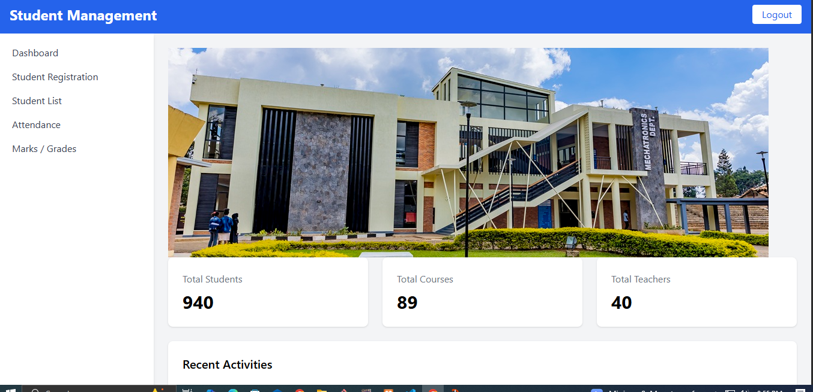
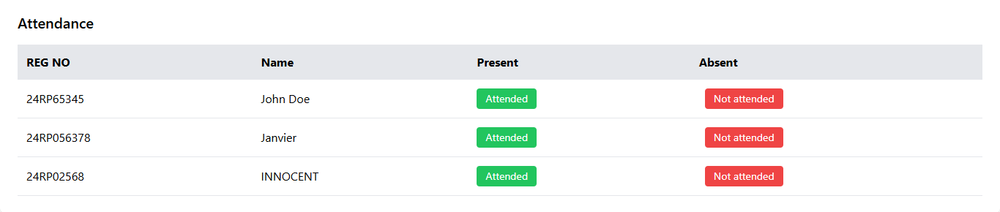
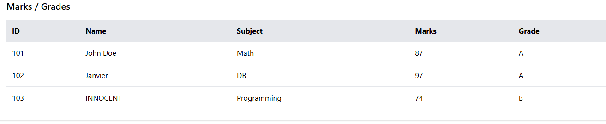
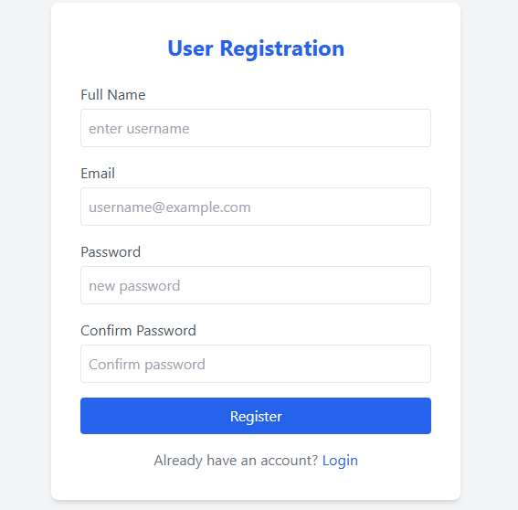
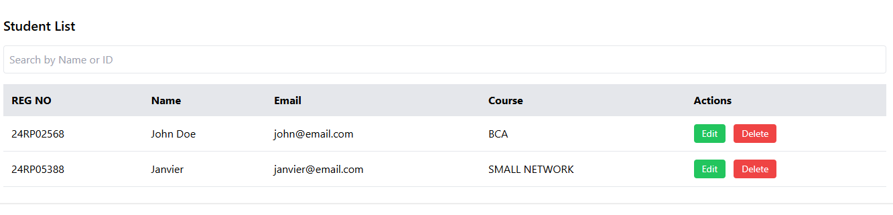

# 🎓 Student Management System

## 📖 Overview
The **Student Management System (SMS)** is a web-based application designed to simplify academic administration. It provides an intuitive interface for managing students, courses, attendance, and grades. Built with **HTML5** and **Tailwind CSS**, it ensures a clean, responsive, and modern design.

## ✨ Features
- **Dashboard**: Displays statistics (total students, courses, teachers).
- **Student Registration**: Register new students with a simple form.
- **Student List**: Searchable list with edit and delete options.
- **Attendance Management**: Mark students as present or absent.
- **Marks / Grades**: Record and view student performance.
- **Recent Activities**: Track updates such as enrollments, marks, and attendance.

## 📂 Project Structure

student-management-system/
│
├── SDMS.html                # Dashboard page (main overview)
├── userlogin.html           # Login page
│
├── student register.html    # Student registration form
├── studentlist.html         # Student list with search, edit, delete
├── attendance.html          # Attendance management page
├── marks.html               # Marks / Grades management page
│
├── assets/                  # Folder for images, CSS, JS, or other resources
│   ├── 2.jpg                # Example image used in dashboard
│   └── ...                  # Additional assets
│
├── README.md                # Documentation file
└── LICENSE                  # (Optional) License file for project

## screenshot

